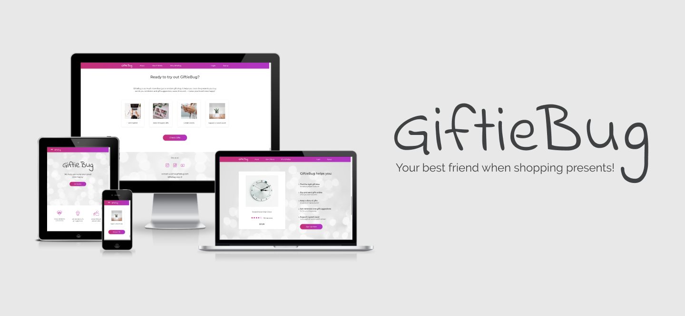

# GiftieBug - One-Page No-Bootstrap Challenge

GiftieBug is an old product idea I've had in mind since before I started to code. The idea came from
[User Experience (UX): The Ultimate Guide to Usability and UX](https://www.udemy.com/course/ultimate-guide-to-ux/) course by
David Travis. One of the proposed UX research topics was Giftgiver, which I further developed into GiftieBug.

As I have so far used Bootstrap in all my projects, I've decided to challenge myself by building a 1-page website.
I didn't want to go into details too much as long as the components worked properly and aligned well with the brand identity
because I do plan to continue using Bootstrap. This piece is my attempt to demonstrate my knowledge about fundamental technologies
used in frontend and to show my dedication to the understand-the-basics approach.

This is just a demo page but I hope to transform this idea into a bigger project. If you're interested in working on it with me,
get in touch!

## Technologies Used

This challenge focuses on the following technologies:

1. [HTML](https://en.wikipedia.org/wiki/HTML) - for creating the layout and the structure of the website
1. [CSS](https://en.wikipedia.org/wiki/Cascading_Style_Sheets) - for styling the website’s HTML code and page responsiveness
1. [JavaScript](https://en.wikipedia.org/wiki/JavaScript) - for adding modal and burger menu functionalities

Additionally, I have also used the following platforms to help me shape the website and the brand:

1. [Gitpod](https://gitpod.io/) - for writing, editing and live previewing the code during the creation process
1. [GitHub](https://github.com/) - for hosting the project's repository and creating a preview link on GitHug pages
1. [Google Fonts](https://fonts.google.com/) - for selecting the fonts and implementing them into the HTML code
1. [Figma](https://www.figma.com/) - for creating wireframes, designs and icons

## Testing

The project's code was validated through:

* [W3 HTML validator](https://validator.w3.org/nu/)
* [W3 CSS validator](http://www.css-validator.org/)
* [Esprima JS validator](https://esprima.org/demo/validate.html)

## Lessons Learned

Throughout my coding bootcamp we have always used Bootstrap. I've realised that I'm relying a lot on certain components, such as
columns, rows, containers, modals, dropdowns and navigation. While this is great for my own projects, the reality is that some
companies avoid it and many create their own frameworks.

There were 5 major lessons I've learned through this no-bootstrap challenge:

1. What is CSS FLEXBOX LAYOUT and how to use it
- I’ve started to use it in my project before this one but never really understood different flexbox properties
- throughout this project I tried to use it as much as possible and by that avoided pixel-perfect margins, paddings, position relative, etc. which often get distorted when working on responsive design and need additional care

2. What are TRANSITION AND TRANSFORM CSS properties
- for some reason these two properties seemed very complicated to me
- it turned out they’re not so difficult to understand and they enabled me to be more creative with my design

3. How to make NAVIGATION from scratch
- I’ve always used Bootstrap components for this task, so this was very time-consuming
- I still need to get better at animating the burger dropdown menu but it works perfectly fine

4. How to make SIMPLE SHAPES with CSS
- normally, I’d design svg icons and display them as images
- this time I coded the present-looking-like burger menu myself

5. How to make SIMPLE ANIMATIONS with CSS and JS
- I also animated the burger menu when users click on it by using transition and transform CSS properties in combination with a javaScript event listener

The reason why I'm sharing my learnings above is to show that there is no one, the best way to learn to code. I've already built
several fully functioning websites, including the [e-commerce web app ECOSiO](https://github.com/valentina-b/ecosio-eco-friendly-cosmetics)
with test purchases, loyalty programme, registration function, admin blog feature, etc. - and yet I've just learned what flexbox actually is.
Depending on the curriculum one follows, some things are learned sooner, some later.

## Credits

### Content

* the content for this website is completely original, written by me

### Media

* the photos are taken from [Unsplash](https://unsplash.com/)
* apart from the burger menu and rating starts, icons were downloaded from [Flaticon](https://www.flaticon.com/)
* the product showcase image was taken with the help of [Ami.ResponsiveDesign](http://ami.responsivedesign.is/)

### Coding Sources

* helped me understand [the code for creating modals](https://www.w3schools.com/howto/howto_css_modals.asp)